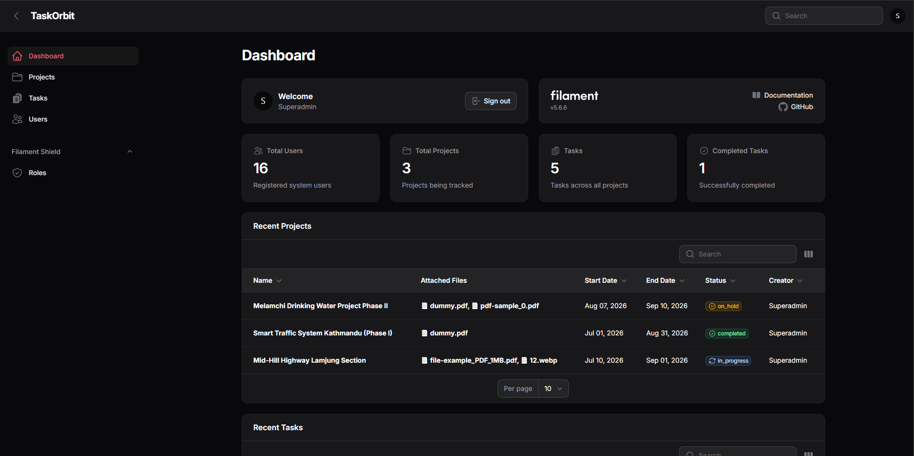

# TaskOrbit

> A Laravel-based project management system with a Filament-powered administrative dashboard.



## Table of Contents

- [About the Project](#about-the-project)
- [Features](#features)
- [Tech Stack](#tech-stack)
- [Screenshots](#screenshots)
- [Role-Based Access Control](#role-based-access-control)
- [Installation](#installation)
- [Environment Variables](#environment-variables)
- [Future Improvements](#future-improvements)
- [License](#license)

## About the Project

TaskOrbit is a project management system currently focused on its administrative dashboard. It allows administrators and authorized users to manage projects, tasks, users, roles, permissions, deadlines, statuses, priorities, and project-related files through a Filament-powered interface.

## Features

### Project Management

- Create, view, update and delete projects
- Track project start and end dates
- Manage project status
- Attach multiple files to projects
- Track project creators and updates
- View related tasks

### Task Management

- Create and manage tasks
- Assign tasks to multiple users
- Associate tasks with projects
- Track task status
- Track task priority
- Set due dates
- Track task creators and updates

### User Management

- Manage registered users
- Assign users to roles
- Control access based on permissions

### Role & Permission Management

- Role-based access control using Filament Shield
- Create and manage roles
- Assign granular permissions
- Separate access for Super Admin, Project Manager and Worker roles

### Dashboard

- System statistics
- Recent projects
- Recent tasks
- Quick access to project and task records
- Search and sorting
- Responsive dashboard layout

### File Management

- Attach files to projects
- Display attached files
- Open uploaded files directly from the dashboard

## Tech Stack

### Backend

- PHP 8.2+
- Laravel 12
- MySQL

### Admin Panel

- Filament 5
- Filament Shield

### Frontend

- Tailwind CSS 4
- Vite

### Development Tools

- Composer
- NPM
- Git / GitHub

## Screenshots

### Dashboard


## Role-Based Access Control

TaskOrbit uses **Filament Shield** to implement role-based access control and granular permissions.

The current roles include:

| Role | Description |
|---|---|
| **Super Admin** | Full access to the administrative system |
| **Project Manager** | Access to project and task management based on assigned permissions |
| **Worker** | Access to functionality permitted by the assigned role |

Permissions can be managed at a granular level, including:

- View Any
- View
- Create
- Update
- Delete
- Delete Any
- Restore
- Restore Any
- Force Delete
- Force Delete Any
- Replicate
- Reorder


## Installation

Follow the steps below to set up TaskOrbit locally.

### 1. Clone the Repository

```bash
git clone https://github.com/your-username/taskorbit.git
cd taskorbit
```

### 2. Install PHP Dependencies

```bash
composer install
```

### 3. Create the Environment File

```bash
cp .env.example .env
```

> On Windows, copy `.env.example` manually and rename it to `.env`.

### 4. Generate the Application Key

```bash
php artisan key:generate
```

### 5. Configure the Database

Create a MySQL database and update the database configuration in your `.env` file:

```env
DB_CONNECTION=mysql
DB_HOST=127.0.0.1
DB_PORT=3306
DB_DATABASE=taskorbit
DB_USERNAME=root
DB_PASSWORD=
```

### 6. Run Migrations

```bash
php artisan migrate
```

If seeders are available and you want to populate the database with sample data:

```bash
php artisan migrate --seed
```

### 7. Create the Storage Link

```bash
php artisan storage:link
```

This is required for accessing files uploaded to project records.

### 8. Install Frontend Dependencies

```bash
npm install
```

### 9. Start the Development Server

Start the Laravel development server:

```bash
php artisan serve
```

In a separate terminal, start Vite:

```bash
npm run dev
```

### 10. Access the Admin Panel

Open the following URL:

```text
http://127.0.0.1:8000/admin
```

Log in using an account with access to the Filament administrative panel.

## Environment Variables

TaskOrbit uses Laravel's `.env` file for local application and database configuration.

The main database variables are:

```env
DB_CONNECTION=mysql
DB_HOST=127.0.0.1
DB_PORT=3306
DB_DATABASE=taskorbit
DB_USERNAME=root
DB_PASSWORD=
```

The application key should also be generated after creating the `.env` file:

```bash
php artisan key:generate
```

## Future Improvements

Planned improvements for TaskOrbit include:

- Build the public-facing/main website
- Add task comments & attachments
- Add notifications
- Add advanced task filtering
- Add project progress tracking
- add Kanban / board view (and/or calendar view)
- Add user-specific dashboards
- Add email notifications
- Add API endpoints & automated tests

## License

This project is open-sourced under the [MIT License](https://opensource.org/licenses/MIT).
